# T.Fundi — Entity Relationship Diagram

| Field        | Value                       |
| ------------ | --------------------------- |
| Document     | Entity Relationship Diagram |
| Product      | T.Fundi                     |
| Version      | 1.0.0                       |
| Status       | Draft                       |
| Owner        | Patricia Njoroge            |
| Last Updated | 2026-08-09                  |

---

# 1. Purpose

This document describes the principal entities and relationships in the T.Fundi platform.

The diagram is logical and intended to communicate domain relationships rather than prescribe the final physical database schema.

---

# 2. Core ERD

```mermaid
erDiagram

    USERS ||--o{ TENANT_MEMBERSHIPS : has
    TENANTS ||--o{ TENANT_MEMBERSHIPS : contains

    TENANTS ||--o{ ROLES : defines
    ROLES ||--o{ ROLE_PERMISSIONS : grants
    PERMISSIONS ||--o{ ROLE_PERMISSIONS : contains
    TENANT_MEMBERSHIPS ||--o{ MEMBERSHIP_ROLES : assigned
    ROLES ||--o{ MEMBERSHIP_ROLES : assigned

    TENANTS ||--o{ ORGANIZATIONAL_UNITS : contains
    ORGANIZATIONAL_UNITS ||--o{ ORGANIZATIONAL_UNITS : parent
    USERS ||--o{ USER_POSITIONS : holds
    ORGANIZATIONAL_UNITS ||--o{ USER_POSITIONS : contains

    TENANTS ||--o{ CATEGORIES : owns
    CATEGORIES ||--o{ PRODUCTS : contains
    PRODUCTS ||--o{ PRODUCT_IMAGES : has
    PRODUCTS ||--o| PRODUCT_MODELS : has
    PRODUCTS ||--o{ PRODUCT_MATERIALS : supports
    MATERIALS ||--o{ PRODUCT_MATERIALS : available
    PRODUCTS ||--o{ PRODUCT_COLORS : supports
    COLORS ||--o{ PRODUCT_COLORS : available

    USERS ||--o{ DESIGNS : creates
    TENANTS ||--o{ DESIGNS : owns
    PRODUCTS ||--o{ DESIGNS : configured_from
    DESIGNS ||--o{ DESIGN_SHARES : shared_as
    USERS ||--o{ DESIGN_SHARES : receives

    USERS ||--o{ AI_JOBS : creates
    TENANTS ||--o{ AI_JOBS : owns
    DESIGNS ||--o{ AI_JOBS : supports

    USERS ||--o{ CARTS : owns
    TENANTS ||--o{ CARTS : scopes
    CARTS ||--o{ CART_ITEMS : contains
    PRODUCTS ||--o{ CART_ITEMS : references

    TENANTS ||--o{ ORDERS : receives
    USERS ||--o{ ORDERS : places
    ORDERS ||--o{ ORDER_ITEMS : contains
    PRODUCTS ||--o{ ORDER_ITEMS : snapshots

    ORDERS ||--o{ PAYMENTS : has
    PAYMENTS ||--o{ PAYMENT_TRANSACTIONS : records

    TENANTS ||--o{ PRODUCTION_WORKFLOWS : defines
    PRODUCTION_WORKFLOWS ||--o{ PRODUCTION_STAGES : contains
    ORDERS ||--o{ PRODUCTION_JOBS : creates
    PRODUCTION_WORKFLOWS ||--o{ PRODUCTION_JOBS : uses
    PRODUCTION_JOBS ||--o{ PRODUCTION_STAGE_RUNS : executes
    PRODUCTION_STAGES ||--o{ PRODUCTION_STAGE_RUNS : represents
    USERS ||--o{ PRODUCTION_JOBS : assigned_to

    PRODUCTION_JOBS ||--o{ PRODUCTION_UPDATES : produces
    USERS ||--o{ PRODUCTION_UPDATES : creates

    PRODUCTION_JOBS ||--o{ QUALITY_CHECKS : undergoes
    QUALITY_CHECKS ||--o{ QUALITY_ISSUES : identifies

    ORDERS ||--o{ DELIVERIES : has
    DELIVERIES ||--o{ DELIVERY_EVENTS : produces

    USERS ||--o{ NOTIFICATIONS : receives
    TENANTS ||--o{ NOTIFICATIONS : scopes

    USERS ||--o{ AUDIT_EVENTS : performs
    TENANTS ||--o{ AUDIT_EVENTS : scopes
```



---

# 3. Identity and Tenant Relationships

```text
User
  │
  ├── Tenant Membership ──→ Tenant
  │
  └── Platform Access
```

A user is a platform identity.

A tenant membership determines the user's relationship with a furniture business.

This allows one identity to potentially participate in multiple tenant organizations.

---

# 4. Authorization Relationships

```text
Tenant Membership
        │
        ↓
      Roles
        │
        ↓
   Permissions
```

Roles are collections of permissions.

The tenant controls which tenant roles exist while T.Fundi controls the available permission vocabulary.

---

# 5. Organizational Relationships

```text
Tenant
  ↓
Organizational Unit
  ↓
Child Organizational Unit
  ↓
User Position
  ↓
User
```

The hierarchy is represented through a parent-child relationship.

This allows tenants to define different organizational structures.

---

# 6. Catalog Relationships

```text
Tenant
  ↓
Category
  ↓
Product
 ├── Product Images
 ├── Product Model
 ├── Materials
 └── Colors
```

Products belong to a tenant.

Products may support multiple materials and colors.

---

# 7. Design Relationships

```text
User
  ↓
Design
  ↓
Product Configuration
  ↓
Design Share
  ↓
Client
```

The design creator and purchaser are separate concepts.

A designer may create a design that is later purchased by:

* The designer
* A customer
* Another authorized party

---

# 8. AI Relationships

```text
User
  ↓
AI Job
  ├── Input
  └── Output
```

AI jobs may support:

* Color matching
* Room visualization
* Future AI capabilities

AI jobs must retain tenant context where the operation involves tenant-owned resources.

---

# 9. Commerce Relationships

```text
User
  ↓
Cart
  ↓
Cart Items
  ↓
Checkout
  ↓
Order
  ↓
Order Items
```

An order belongs to one tenant.

An order item preserves the purchased configuration.

---

# 10. Payment Relationships

```text
Order
  ↓
Payment
  ↓
Payment Transaction
```

Payment state is separate from order state.

This allows payment retries, callbacks, refunds, and provider-specific transactions without conflating them with the order lifecycle.

---

# 11. Production Relationships

```text
Tenant
  ↓
Production Workflow
  ↓
Production Stage
        ↓
Order
  ↓
Production Job
  ↓
Stage Run
```

Production workflows are tenant-configurable.

Production jobs reference the workflow appropriate to the tenant.

---

# 12. Production Update Relationships

```text
Production Job
  ↓
Production Update
  ├── Employee
  ├── Photo
  ├── Notes
  └── Visibility
```

Visibility distinguishes internal workshop information from customer-facing information.

---

# 13. Quality Control Relationships

```text
Production Job
  ↓
Quality Check
  ├── PASS
  └── FAIL
        ↓
    Quality Issue
        ↓
      Rework
```

Quality control is represented independently from production completion.

---

# 14. Delivery Relationships

```text
Order
  ↓
Delivery
  ↓
Delivery Event
```

A delivery may have multiple events representing its progression.

---

# 15. Notification Relationships

```text
User
  ↓
Notifications
```

Notifications may originate from:

* Orders
* Payments
* Production
* Delivery
* Design sharing

---

# 16. Audit Relationships

```text
User
  ↓
Audit Event
  ↓
Resource
```

Audit events may be tenant-scoped or platform-scoped.

---

# 17. Tenant Ownership

The following entities are expected to have explicit tenant ownership:

```text
Categories
Products
Materials
Colors
Designs
AI Jobs
Carts
Orders
Production Workflows
Production Jobs
Notifications
Audit Events
```

Some entities may inherit tenant context through relationships, but direct tenant references are preferred where they materially simplify authorization and isolation.

---

# 18. Important Invariants

### Tenant isolation

```text
Resource.tenant_id
        =
Authorized Tenant
```

### Order ownership

```text
Order → exactly one Tenant
```

### Membership uniqueness

```text
Tenant + User
        =
one Membership
```

### Role scope

```text
Tenant Role → exactly one Tenant
```

### Historical order integrity

```text
Catalog changes
      ≠
Historical order changes
```

### Production configuration

```text
Tenant
  →
Configurable Workflow
```

---

# 19. Deferred Physical Schema Decisions

This ERD does not prescribe:

* Exact column types.
* UUID implementation.
* Index implementation.
* JSON storage strategy.
* Database partitioning.
* Row-level security.
* Search infrastructure.
* Read replicas.
* Sharding.

Those decisions belong in the implementation database design.

---

# 20. Related Documents

* `DATABASE_DESIGN.md`
* `architecture/MULTI_TENANCY.md`
* `architecture/SYSTEM_ARCHITECTURE.md`
* `product/USER_JOURNEYS.md`
* `engineering/ADR/ADR-0001-multi-tenant-platform.md`
* `engineering/ADR/ADR-0002-tenant-configurable-authorization.md`

---

# 21. Document Status

This is the initial logical ERD for T.Fundi.

The physical schema may evolve while preserving the relationships and invariants defined here.
